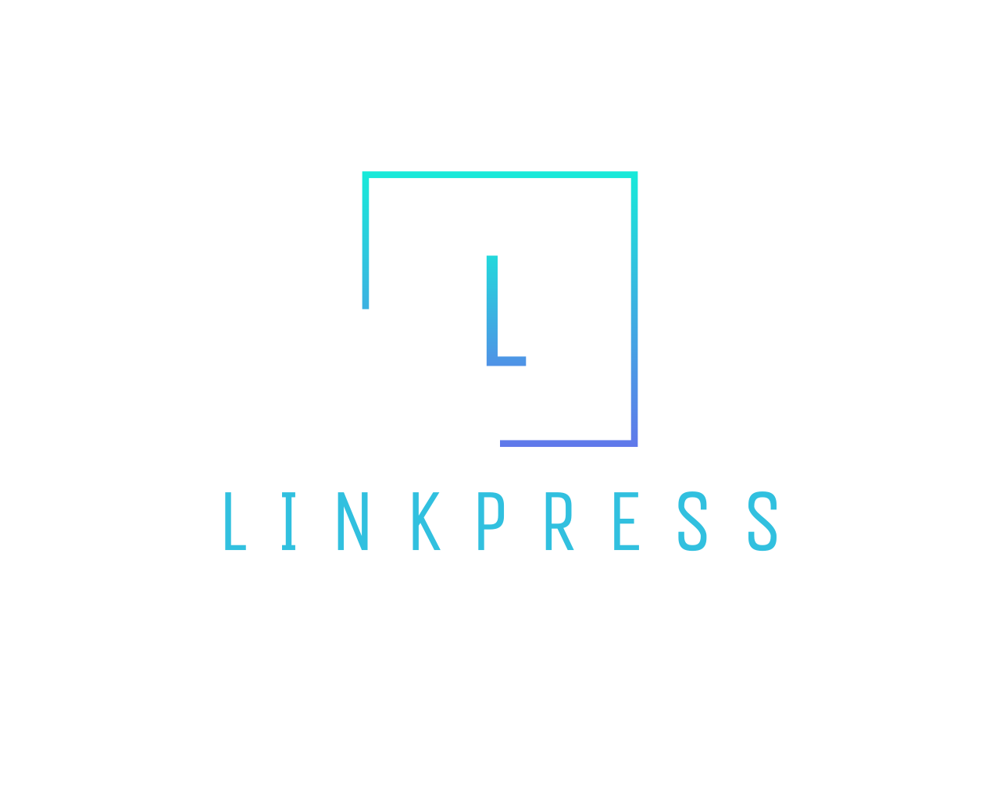
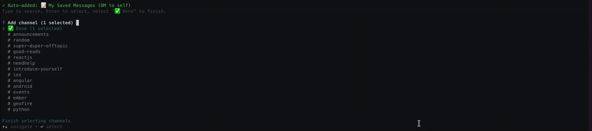

<p align="center">
  
</p>

<p align="center">
  <strong>Turn your Slack links into a personal tech magazine</strong>
</p>

<p align="center">
  <a href="https://www.npmjs.com/package/linkpress"></a>
  
</p>

<p align="center">
  
</p>

---

## Why LinkPress?

Great tech articles get shared in Slack every day. But they pile up, get buried, and you never read them.

**LinkPress fixes this.** It collects links from your Slack channels, uses AI to summarize them, and generates a beautiful magazine you'll actually want to read.

- 🤖 **AI-Powered Summaries** — Get the gist before you click (Claude, GPT, or Gemini)
- 📰 **Magazine-Style UI** — Not a boring list, but a curated reading experience
- 🔒 **100% Local** — Your data stays on your machine
- ⚡ **5 Minutes Setup** — Install, connect Slack, done


## Requirements

- Node.js 18+
- AI API key (Anthropic, OpenAI, or Google)
- Slack account


## Quick Start

```bash
# Install globally
npm install -g linkpress

# Initialize (set up AI provider)
linkpress init

# Connect your Slack workspace
linkpress source add slack

# Sync, generate, and view!
linkpress sync
linkpress generate
linkpress serve
```


## Step 1: Connect Slack

Connect your Slack workspace with automatic token extraction. No OAuth app needed — just log in.

```bash
linkpress source add slack
```

<p align="center">
  
</p>

> **⚠️ Important:** When the browser opens, **DO NOT open in the Slack desktop app**. 
> You must click **"Use Slack in your browser"** to continue.
> The automatic token extraction only works in the browser, not in the desktop app.

> **📝 Note:** We recommend the **Automatic** method (default). If automatic extraction fails, 
> you can select **Manual** mode and paste tokens from your browser's DevTools. 
> The CLI will guide you through the process.

Select the channels you want to watch with real-time autocomplete. Your **Saved Messages** is auto-added by default. Type to search, enter to select, and pick "Done" when finished.

<p align="center">
  
</p>

> **💡 Tip:** Saved Messages is the easiest way to curate links — just forward interesting articles to yourself in Slack!


## Step 2: Sync Links

Fetch links from your connected Slack channels. AI automatically filters out noise (internal docs, videos, etc.) and keeps only valuable tech content.

```bash
linkpress sync
```

<p align="center">
  
</p>


## Step 3: Generate Magazine
> **⚠️ Important:** Slack tokens expire periodically. If you see `invalid_auth` errors during sync, re-run `linkpress source add slack` to refresh your token.

Process articles with AI and generate your personal magazine. Each article gets:
- Catchy headline
- TL;DR summary
- Key points
- Difficulty level
- Reading time

```bash
linkpress generate
linkpress serve
```

<p align="center">
  
</p>

> **Note:** Some websites with bot detection may fail to scrape (HTTP 403). These articles will be skipped during processing, but you can still access them via the original URL.


## Features

### 🤖 AI-Powered
- **Anthropic** (Claude) - Currently supported
- **OpenAI** (GPT) - Coming soon
- **Google** (Gemini) - Coming soon

### 📊 Smart Classification
Articles are automatically tagged and classified by:
- Topic (Frontend, Backend, DevOps, AI/ML, etc.)
- Difficulty (Beginner, Intermediate, Advanced)
- Reading time

### 🌙 Light & Dark Theme
Toggle between light and dark mode. Your preference is saved.

### ✅ Read/Unread Tracking
Keep track of what you've read. Mark articles as read with a single click.

### 👀 Watch Mode
Real-time monitoring — new articles appear automatically as they're shared.

```bash
linkpress serve --watch
```

### 🌍 Multilingual
AI summaries in your preferred language (English, 한국어, 日本語, 中文, etc.)


## Commands

| Command | Description |
|---------|-------------|
| `linkpress init` | Set up AI provider and preferences |
| `linkpress source add slack` | Connect a Slack workspace |
| `linkpress source list` | List connected sources |
| `linkpress source remove slack` | Remove a workspace |
| `linkpress sync` | Fetch links from Slack |
| `linkpress add <url>` | Manually add a URL |
| `linkpress list` | Show saved articles |
| `linkpress generate` | Process articles and create magazine |
| `linkpress generate --skip-process` | Regenerate without AI processing |
| `linkpress serve` | Start local server (localhost:3000) |
| `linkpress serve --watch` | Start with real-time monitoring |
| `linkpress clear` | Delete all articles |


## Configuration

Configuration is stored in `~/.linkpress/config.yaml`:

```yaml
ai:
  provider: anthropic  # anthropic, openai, or gemini
  model: claude-sonnet-4-5-20250929
  apiKey: sk-ant-...
  language: English    # Summary language

sources:
  slack:
    - workspace: MyWorkspace
      channels:
        - id: C01234567
          name: tech-links

output:
  directory: ~/.linkpress/output
  format: html
```


## Contributing

Contributions are welcome! Feel free to:

- 🐛 Report bugs
- 💡 Suggest features
- 🔧 Submit pull requests


## Author 

[Changmin (Chris) Kang](https://github.com/mindori)